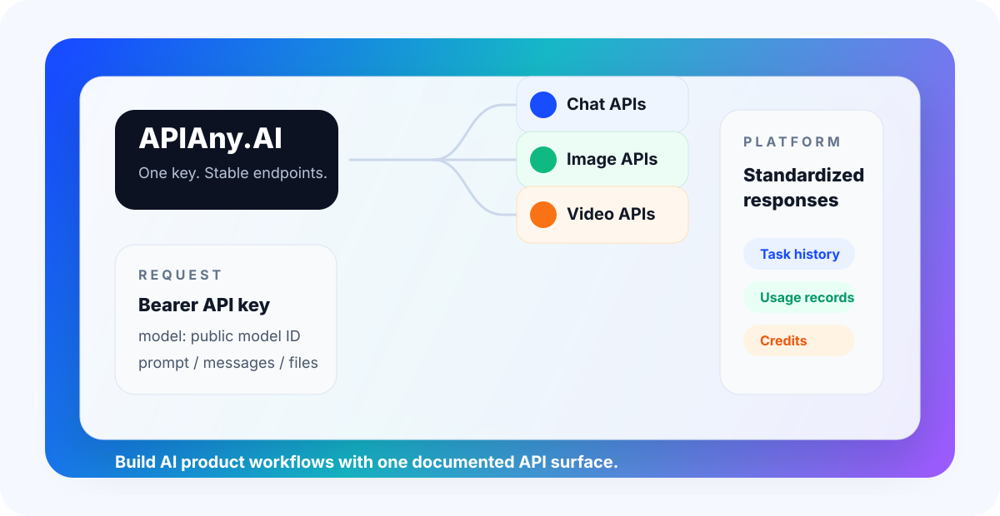
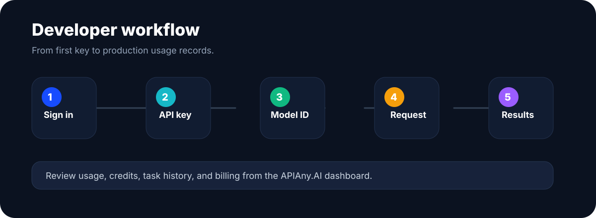
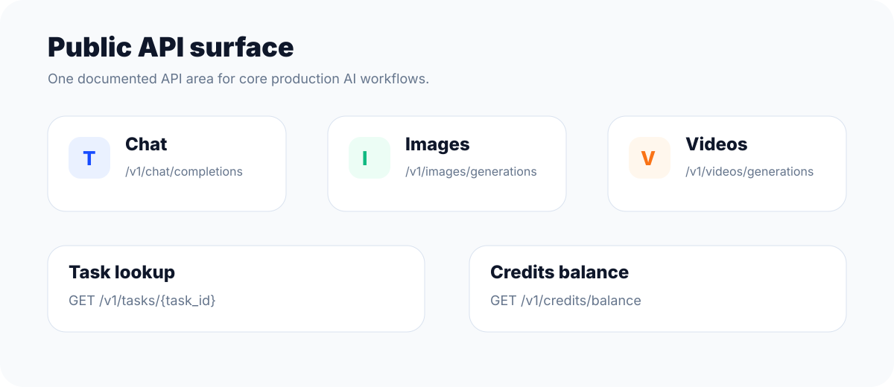

# APIAny.AI Developer Documentation

Official documentation for [APIAny.AI](https://apiany.ai), a unified AI API platform for production applications, agents, and creative workflows.

APIAny.AI gives developers one account, one API key, and one consistent API surface for chat, image generation, video generation, multimodal generation, task history, credits, and usage records.

<p>
  <a href="https://docs.apiany.ai"><strong>Read the docs</strong></a>
  ·
  <a href="https://apiany.ai">Visit APIAny.AI</a>
  ·
  <a href="https://apiany.ai/dashboard/api-keys">Get an API key</a>
  ·
  <a href="https://github.com/ailingqu/ApiAny.AI-MCP">MCP Server</a>
  ·
  <a href="https://apiany.ai/pricing">Pricing</a>
</p>



## What APIAny.AI Provides

APIAny.AI is built for teams that want to ship AI features without wiring separate billing systems, task polling, usage dashboards, and endpoint variations for every model family.

- **Unified model catalog** — use stable public model IDs for chat, image, video, and multimodal tasks.
- **Open API standards** — call OpenAI-compatible chat, Anthropic-compatible messages, Gemini-compatible content generation, and media generation endpoints through one platform.
- **Async media workflows** — create long-running image and video tasks, then poll a single task endpoint for status and results.
- **Credits and billing** — manage API usage with account credits, balance checks, usage records, and invoice-ready order history.
- **Developer dashboard** — create API keys, test models in the playground, inspect request history, and review usage.
- **Production-ready docs** — public guides, model pages, endpoint references, examples, and AI-readable docs.

## Developer Experience



1. Sign in to [APIAny.AI](https://apiany.ai).
2. Create an API key in the dashboard.
3. Pick a public model ID from the model catalog.
4. Send a request to a stable `/v1` or `/v1beta` endpoint.
5. For media jobs, poll `/v1/tasks/{task_id}` until the result is ready.
6. Track credits, usage records, and request history in the dashboard.

## Core API Surfaces



| Area | Endpoint | Purpose |
| --- | --- | --- |
| Chat completions | `POST /v1/chat/completions` | OpenAI-compatible chat and text generation |
| Responses | `POST /v1/responses` | Unified response-style generation |
| Messages | `POST /v1/messages` | Anthropic-compatible message requests |
| Gemini content | `POST /v1beta/models/{model}:generateContent` | Gemini-compatible content generation |
| Image generation | `POST /v1/images/generations` | Asynchronous image generation |
| Image sync | `POST /v1/images/generations/sync` | Blocking image generation for simple workflows |
| Image edits | `POST /v1/images/edits` | Image editing and reference-image workflows |
| Video generation | `POST /v1/videos/generations` | Asynchronous video generation |
| Video sync | `POST /v1/videos/generations/sync` | Blocking video generation for simple workflows |
| Tasks | `GET /v1/tasks/{task_id}` | Query image and video task status/results |
| Credits | `GET /v1/credits/balance` | Check account credit balance |

## Repository Contents

This repository powers [docs.apiany.ai](https://docs.apiany.ai), the public APIAny.AI documentation site.

| Path | Description |
| --- | --- |
| `docs.json` | Mintlify navigation, branding, theme, and language configuration |
| `openapi.json` | English OpenAPI reference source |
| `zh/openapi.json` | Chinese OpenAPI reference source |
| `*.mdx` | English guides and concept pages |
| `zh/*.mdx` | Chinese guides and concept pages |
| `models/` | Model catalog pages |
| `reference/` | Endpoint guide pages |
| `operations/` | Billing, rate limits, errors, and webhook guides |
| `snippets/` | Shared MDX snippets for base URL and authentication |
| `scripts/` | Validation and documentation utility scripts |

## Local Preview

```bash
pnpm install
pnpm validate
pnpm dev
```

`pnpm dev` starts a Mintlify local preview. The site is designed to publish to [docs.apiany.ai](https://docs.apiany.ai).

## Documentation Quality Rules

This docs site is public-facing. Write from APIAny.AI's first-party product voice and keep the content focused on what developers need to integrate the public API.

- Explain public model IDs, endpoint behavior, authentication, errors, billing, and usage records.
- Keep request examples copy-pasteable.
- Keep English and Chinese pages aligned when adding or changing public docs.
- Run `pnpm validate` before committing.
- Do not publish internal platform details that are not part of the public API contract.

## Product Links

- Website: [apiany.ai](https://apiany.ai)
- Docs: [docs.apiany.ai](https://docs.apiany.ai)
- Dashboard: [apiany.ai/dashboard](https://apiany.ai/dashboard)
- Model catalog: [apiany.ai/models](https://apiany.ai/models)
- Pricing: [apiany.ai/pricing](https://apiany.ai/pricing)
- MCP server: [github.com/ailingqu/ApiAny.AI-MCP](https://github.com/ailingqu/ApiAny.AI-MCP)

## License

This repository contains the official APIAny.AI documentation content and brand assets. All rights reserved.
